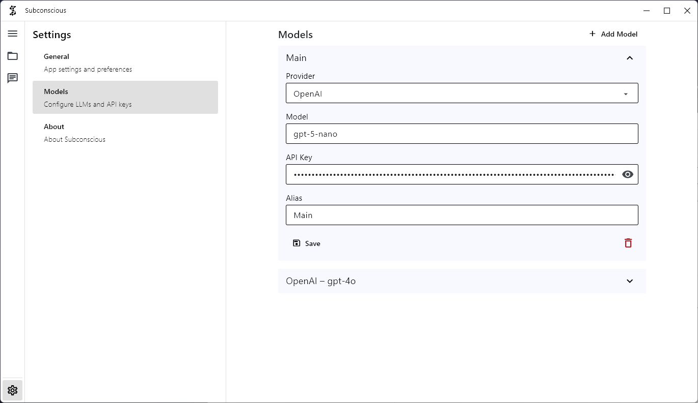

# Subconscious Server

> The distributed agentic UI - local-first, open source, and designed to run everywhere.


Subconscious is a local-first AI workspace with threads, workspaces, built-in tools, OAuth integrations, and encrypted account data. It runs across web, desktop, mobile, and the terminal, with the backend acting as a thin identity and integration layer.

## Highlights

- Local-first by default: chats and state stay on your device.
- Built-in tools: terminal, filesystem, calculator, clipboard, contacts, time, weather, and web tools.
- Workspaces and threads: keep conversations organized by project or purpose.
- OAuth and API key integrations: connect providers like Google, Microsoft, OpenAI, GitHub, Hugging Face, and Discord.
- Encrypted secrets: tokens and keys are stored securely at rest.

## Product Screenshots




## Live Endpoints

| URL | Purpose |
|---|---|
| https://subconscious.chat | Marketing site |
| https://app.subconscious.chat | Web app |
| https://api.subconscious.chat | FastAPI backend |
| https://docs.subconscious.chat | Documentation |

## Getting Started

### Install on Windows

```bash
winget install Ancilla.Subconscious-Chat
```

### Install with pip

```bash
pip install -U subconscious-chat
```

### Run from source

```bash
git clone https://github.com/Ancilla-Company/Subconscious.git
cd Subconscious/backend

cp .env.example .env
# Fill in APP_SECRET_KEY, JWT_SECRET_KEY, TOKEN_ENCRYPTION_KEY

docker compose up -d
docker compose exec api python -m alembic upgrade head
```

## Local Development

```bash
pip install uv
uv sync --extra dev
cp .env.example.dev .env
# Fill in TOKEN_ENCRYPTION_KEY and JWT_SECRET_KEY

docker compose up -d
python -m alembic upgrade head
uvicorn app.main:app --reload --port 8000
```

API: http://localhost:8000  
Swagger UI: http://localhost:8000/docs

## Generate Secrets

```bash
# APP_SECRET_KEY / JWT_SECRET_KEY
python -c "import secrets; print(secrets.token_hex(32))"

# TOKEN_ENCRYPTION_KEY
python -c "from cryptography.fernet import Fernet; print(Fernet.generate_key().decode())"
```

## Docs Site

```bash
cd docs-site
pip install mkdocs-material mkdocstrings[python]
mkdocs serve
```

Or via Docker:

```bash
docker compose --profile docs up docs
```

## Project Structure

```
backend/
├── app/
├── migrations/
├── tests/
└── Dockerfile
docs-site/
docs/
```

## License

MIT
